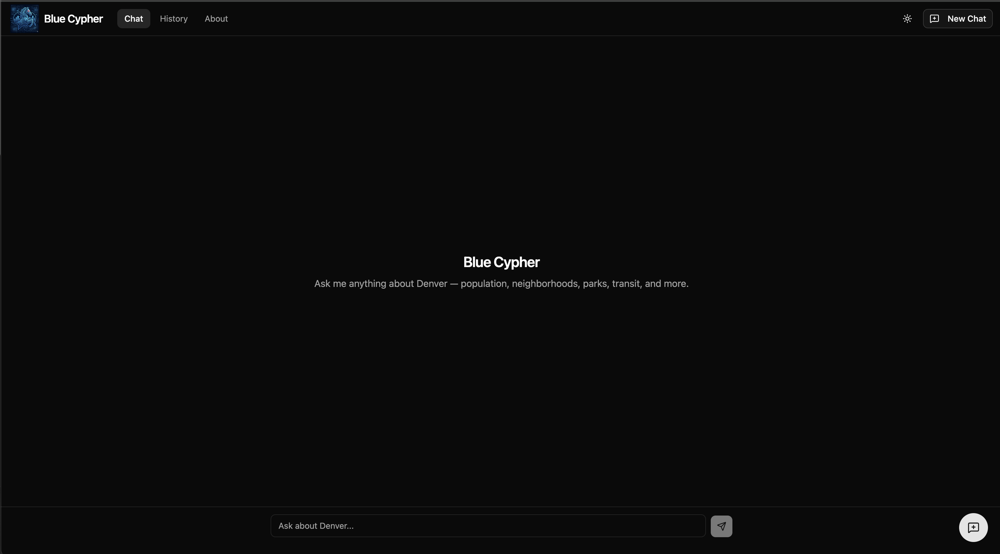
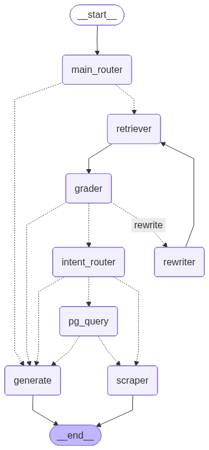

# Blue Cypher

**Agentic RAG powered by the Denver Open Data Catalog.**

Ask natural-language questions about Denver neighborhoods — demographics, crime,
parks, transit, weather, civic services — and get direct, cited answers drawn
from city open data, live transit feeds, and the National Weather Service.

🔗 **Live:** [bluecypher.ai](https://bluecypher.ai/)<br>
💻 **Frontend repo:** [uelski/den_bot_frontend](https://github.com/uelski/den_bot_frontend)



> A LangGraph orchestrator over hybrid vector retrieval, real-time API tools,
> and conditional parallel branches — deployed to Cloud Run with Qdrant Cloud
> and Redis-backed multi-turn memory.

---

## What it does

A user types a question. A LangGraph agent classifies the intent, decides
between catalog retrieval, live-API tools, or direct response, and streams a
cited answer back over server-sent events. Multi-turn conversation history is
checkpointed in Redis so follow-ups like *"how about Park Hill?"* resolve
against the prior topic.

**Try queries like:**

- *"What are the demographics of RiNo?"*
- *"How does crime in Capitol Hill compare to Five Points?"*
- *"What's the weather in Park Hill this weekend?"*
- *"When's the next train at Union Station?"*
- *"Where can I report a pothole in Denver?"*

---

## Highlights

- **Agentic RAG over civic data** — a LangGraph orchestrator routes between catalog retrieval (~900 indexed services across parks, crime, schools, libraries, traffic, demographics) and a tool-calling branch for live data (weather, RTD transit, denvergov.org search).
- **Hybrid retrieval** — dense (Google `gemini-embedding-001`) + sparse (BM25 via `fastembed`) fusion in Qdrant.
- **Parallel branches** — the LangGraph orchestrator fans out generation and scraping concurrently when a query needs both narrative response *and* a live ArcGIS layer fetch. The user sees streaming tokens immediately while the scraper completes in the background.
- **History-aware query rewriting** — a dedicated `condenser` node rewrites follow-ups into self-contained retrieval queries (the literal user query is preserved for the generator, so the response still answers what was actually asked).
- **Five live-data tools** — NWS weather, three RTD GTFS-realtime feeds (alerts / next arrivals / vehicle positions), and a Tavily-backed denvergov.org search. The agent picks tools by reading their docstrings; adding a new tool is one decorator + a registry append.
- **Shipped to production on GCP** — Cloud Run + Qdrant Cloud + Redis Cloud, CI/CD via Cloud Build on `main` push, observability via LangSmith tracing.

---

## Architecture



The agent graph (rendered live via `python -m scripts.visualize_graph`):
see `graph.png` above. The orchestrator wiring is in
[`app/graph/orchestrator.py`](app/graph/orchestrator.py); each node lives in
[`app/graph/nodes/`](app/graph/nodes/).

**Key nodes:**

| Node | Job |
|---|---|
| `main_router` | LLM classifier with structured output → `data_search` / `tool` / `general`. History-aware so follow-ups resolve against prior topic. |
| `condenser` | Rewrites the latest user message into a self-contained retrieval query. Only runs on the RAG path; preserves the literal `query` for the generator. |
| `retriever` | Hybrid (dense + BM25) Qdrant search, top-k=5. |
| `grader` | LLM relevance gate. If irrelevant, loops back through `rewriter` (max 2 retries) or gives up and generates. |
| `intent_router` | Decides whether to fan out into the scraper based on doc metadata + query semantics. |
| `tool_agent` | Bounded ReAct loop binding all `@tool` functions to Gemini; runs ≤3 iterations. |
| `scraper` | Async ArcGIS HTML fetch for live layer/field data. Runs *parallel* with `generate` when triggered. |
| `generator` | Streaming LLM response; always the terminal node. |

---

## Tech stack

- **Language / runtime** — Python 3.11
- **Agent orchestration** — LangGraph + LangChain
- **LLMs** — Google Gemini (`gemini-2.5-flash` by default)
- **Embeddings** — Google `gemini-embedding-001` (dense) + `Qdrant/bm25` (sparse)
- **Vector DB** — Qdrant (hybrid retrieval mode)
- **API layer** — FastAPI with SSE streaming via `sse-starlette`
- **Multi-turn memory** — `langgraph-checkpoint-redis` (AsyncRedisSaver) on Redis 8 (Redis Cloud)
- **Real-time data** — NWS weather API, RTD GTFS-realtime feeds (protobuf), Tavily search
- **Observability** — LangSmith tracing
- **Deploy** — Docker → Cloud Build → Artifact Registry → Cloud Run (us-east4)
- **Testing** — pytest + pytest-asyncio (93 tests across nodes, tools, routing, SSE payloads)

---

## Data sources

**Indexed in Qdrant (`denver_gis_catalog`):**

- Full Denver Open Data Catalog (ArcGIS FeatureServer service summaries)
- Parks (374 POIs)
- Crime (78 per-neighborhood aggregates)
- Libraries (27 POIs), Rec centers (31 POIs)
- Public + non-public schools (278 POIs)
- Traffic accidents (78 per-neighborhood aggregates)
- Neighborhood demographics (per-neighborhood ACS summaries)

**Live via agent tools:**

- NWS weather forecasts (resolved via neighborhood centroid → lat/lon → NWS two-hop)
- RTD service alerts, next arrivals, vehicle positions (GTFS-realtime)
- denvergov.org bureaucratic search (Tavily-backed)

---

## Notable system design decisions

A few choices worth calling out, with links to the relevant code:

**Two-query split between retrieval and generation**
([`app/graph/nodes/condenser.py`](app/graph/nodes/condenser.py)) —
the literal user query is preserved for the generator (so the answer matches
what the user actually asked) while a separate `search_query` field holds the
history-resolved standalone form used for Qdrant. This lets *"how about Park
Hill?"* embed correctly while the LLM still answers conversationally.

**Parallel branches over sequential blocking**
([`app/graph/orchestrator.py`](app/graph/orchestrator.py) — `route_after_intent`) —
when a query needs both a narrative response and a live ArcGIS layer fetch,
the orchestrator fans out `generate` and `scraper` concurrently rather than
serializing them. The user sees streaming tokens immediately while the scraper
completes in the background; the SSE layer multiplexes both into the response
stream.

**Docstring-driven tool selection**
([`app/tools/registry.py`](app/tools/registry.py)) —
the `tool_agent` binds all `@tool`-decorated functions to the LLM and lets the
model pick via docstring matching. Adding a tool is one decorator + a list
append; no routing logic to update. Negative-list prompting (e.g., "Do NOT use
this tool for parks, libraries…") prevents the catch-all search tool from
competing with structured retrieval.

**Three-way intent classification with structured output**
([`app/graph/nodes/router.py`](app/graph/nodes/router.py)) —
the entry router uses `with_structured_output` against a Pydantic enum
(`data_search` / `tool` / `general`) so the boolean flags driving the
orchestrator are guaranteed to be one of three valid states. No parsing, no
defensive fallbacks needed.

**Hybrid retrieval with single-collection HYBRID mode**
([`app/graph/nodes/retriever.py`](app/graph/nodes/retriever.py)) —
Qdrant's hybrid mode fuses dense and sparse rankings server-side; no manual
RRF merge logic. Singleton vector store via `@lru_cache` to avoid
reconnecting per request.

**Stateless graph at module load + stateful graph at FastAPI lifespan startup**
([`app/main.py`](app/main.py)) —
tests and the no-Redis fallback use the module-level graph; production
compiles a separate graph with an AsyncRedisSaver checkpointer at startup so
multi-turn memory works without forcing Redis as a hard dependency for dev.

---

## Local development

**Prereqs:** Python 3.11, Docker.

```bash
# 1. Clone + venv
git clone https://github.com/uelski/den_bot_server.git
cd den_bot_server
python3.11 -m venv .den_venv
source .den_venv/bin/activate
pip install -r requirements.txt

# 2. Bring up local Qdrant + Redis
docker compose up -d

# 3. Copy env template and fill in keys
cp .env.example .env
# minimum required: GEMINI_API_KEY
# optional: TAVILY_API_KEY (denvergov search), RESEND_API_KEY (feedback email),
#          LANGCHAIN_API_KEY (LangSmith tracing)

# 4. Ingest the catalog into Qdrant
python -m scripts.ingest

# 5. Run the API
uvicorn app.main:app --reload
```

Then `POST` to `http://localhost:8000/query` with `{"query": "..."}` to get
an SSE stream of `token` / `tool_call` / `tool_result` / `sources` / `done`
events. Or run the frontend from
[uelski/den_bot_frontend](https://github.com/uelski/den_bot_frontend) and
point it at the local API.

**Other useful commands:**

```bash
pytest                              # run the test suite
python -m scripts.visualize_graph   # regenerate graph.png + graph.mmd
python -m scripts.ingest_neighborhoods  # (re)ingest demographics
```

---

## Production deployment

Deployed to **GCP Cloud Run** (project `blue-cypher`, region `us-east4`):

- **Cloud Build trigger** on `main` push → builds image → pushes to Artifact Registry → deploys to Cloud Run
- **Qdrant Cloud** for vector storage (public TLS, hybrid mode)
- **Redis Cloud (Redis 8)** for the LangGraph checkpointer — chosen because `langgraph-checkpoint-redis` requires the RedisJSON + RediSearch modules, which Redis 8 bundles in core
- **Secret Manager** for all API keys + connection strings
- **LangSmith** for tracing every `/query` run

Full runbook in [`deployment.md`](deployment.md).

---

## Roadmap

Active priority list lives in [`NEXT_STEPS.md`](NEXT_STEPS.md). Longer-term
v2 thinking — including a PDF Knowledge Base ingestion pipeline (signed-URL
uploads, GCS-native Pub/Sub, separate Cloud Run worker service, parent/child
chunking with Cohere rerank) — is in [`ITERATION_V2.md`](ITERATION_V2.md).

---

## Repo layout

```
app/
├── main.py                  # FastAPI app, SSE streaming, lifespan-managed graph
├── graph/
│   ├── orchestrator.py      # StateGraph assembly + conditional edges
│   ├── state.py             # AgentState TypedDict
│   ├── memory.py            # AsyncRedisSaver wiring + history truncation
│   └── nodes/               # main_router, condenser, retriever, grader,
│                            # intent_router, rewriter, generator, scraper, tool_agent
├── tools/
│   ├── registry.py          # @tool definitions bound to the agent
│   ├── weather.py, rtd_*.py, denvergov_search.py
└── prompts/                 # per-node system prompts

scripts/                     # ingest, visualize, audit, repair utilities
tests/                       # pytest suite (nodes, tools, routing, SSE)

ARCHITECTURE.md              # graph state + parallel streaming rationale
AGENT.md                     # node-level implementation reference
deployment.md                # GCP deployment runbook
NEXT_STEPS.md                # current priority list
ITERATION_V2.md              # v2 planning (PDF KB, rerank, etc.)
```

---

> **Note:** Blue Cypher is in active development. AI can make mistakes — verify anything important against the linked sources.

## License

Released under the [MIT License](LICENSE).

